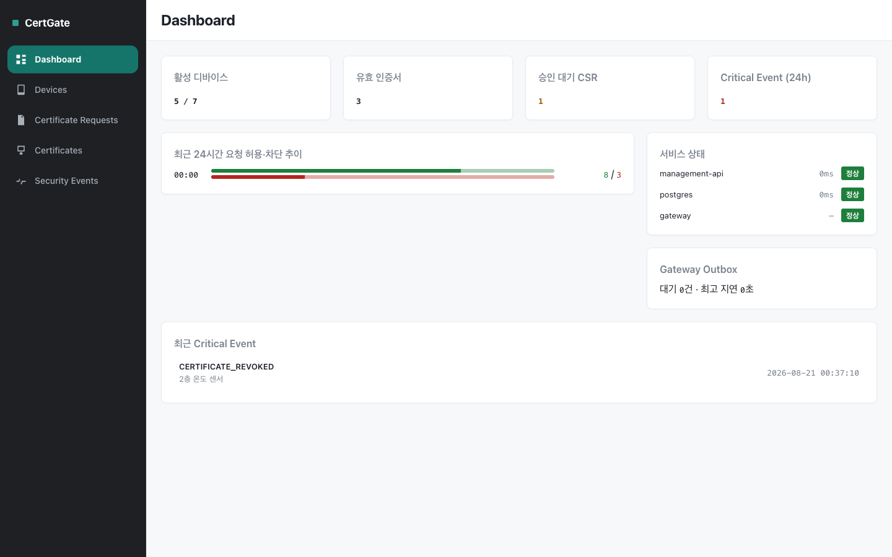
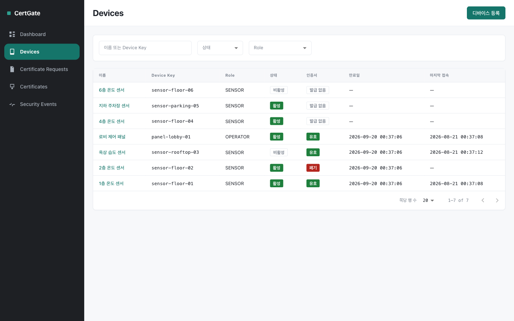
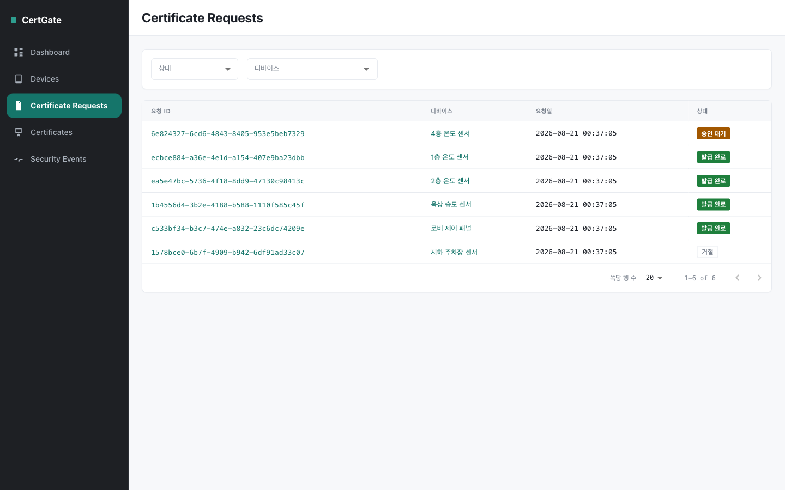
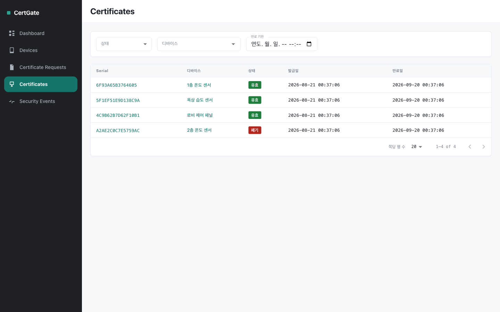
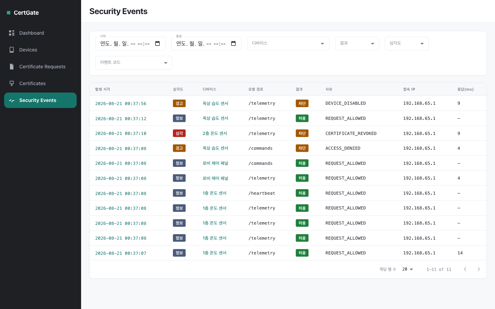

# CertGate

X.509 인증서와 mTLS를 이용해 네트워크 디바이스의 신원을 검증하고, 인증·인가된 요청만 내부 서비스로 전달하는 보안 게이트웨이 및 관리 플랫폼입니다.

> 특정 제품을 복제하지 않고, “서버는 접속한 네트워크 디바이스를 어떻게 신뢰할 수 있는가?”라는 문제를 일반 네트워크 장비 관리 환경으로 재해석합니다.

## 핵심 흐름

~~~text
Device 등록 → 단기 Enrollment Token 발급 → Device에서 Key·CSR 생성
→ 관리자 CSR 승인 → Device 인증서 발급 → Gateway mTLS 인증
→ Device·Certificate·Policy 검증 → Backend 전달 또는 차단
→ Security Event 저장 → Critical Event SSE 알림
~~~

## 기술 스택

| 영역 | 기술 | 사용 목적 |
| --- | --- | --- |
| Device Agent | Go | 개인키·CSR 생성, 인증서 보관, 가상 디바이스 테스트 (mTLS Client는 미구현) |
| Security Gateway | Go | TLS 1.3, X.509 검증, 접근 정책, Reverse Proxy, Event Outbox |
| Management API | Java, Spring Boot | Device·Enrollment·CSR·Certificate·Policy·Event API와 SSE |
| Admin Console | React, TypeScript, Vite, MUI | 운영 정보 조회와 인증서 관리 |
| Database | PostgreSQL | 운영 메타데이터와 Security Event 저장 |
| Gateway Outbox | SQLite | Management API 장애 중 Event 영속 보관·재전송 |
| PKI | OpenSSL, X.509 | Root·Intermediate CA와 Device 인증서 발급 |
| Infrastructure | Docker Compose, GitHub Actions | 통합 실행, 빌드·테스트·비밀정보 검사 |

## 개발 기준 문서

- [요구사항](docs/requirements.md)
- [전체 아키텍처](docs/architecture.md)
- [보안 설계](docs/security-design.md)
- [API 구현 계약](docs/api-spec.md)
- [데이터 모델](docs/data-model.md)
- [저장소·모듈 구조](docs/repository-structure.md)
- [개발 환경과 규칙](docs/development-guide.md)
- [구현 계획과 일정](docs/implementation-plan.md)
- [테스트 전략](docs/testing.md)
- [배포·운영 설계](docs/operations.md)
- [ADR 목록](docs/adr)
- [AI 활용 및 검증 기록](docs/ai-usage.md)

화면 계약은 [UI 설계](docs/ui-design.md)에 있습니다. 설계 단계의 [와이어프레임](docs/wireframes/certgate-console-wireframe.html)은 참고 자료로 남겨 두고, 현재 화면은 아래 "관리 콘솔 화면"을 보십시오.

## 관리 콘솔 화면

아래는 Compose로 띄운 전체 스택에 가상 Device 7대를 등록하고, CSR 승인·발급·폐기와 Gateway mTLS 요청까지 실제로 수행한 뒤 캡처한 화면입니다. Mock 데이터가 아니라 PostgreSQL에 저장된 실제 기록입니다.

### Dashboard

디바이스·인증서 요약, 최근 24시간 허용·차단 추이, 서비스 상태, Gateway Outbox 적체, 최근 Critical Event를 한 화면에 모읍니다.

### Devices

Device 목록과 상태·Role·인증서 상태. 등록, 활성화/비활성화, Role 변경, Enrollment Token 재발급을 여기서 합니다.

### Certificate Requests

Device가 제출한 CSR을 관리자가 승인하거나 거절합니다. 승인 시 Intermediate CA가 서명합니다.

### Certificates

발급된 인증서의 상태(유효·만료 임박·만료·폐기)와 폐기·공개 인증서 다운로드.

### Security Events

Gateway의 모든 접근 판단 기록입니다. 위 캡처에는 정상 허용(`REQUEST_ALLOWED`), 권한 없는 경로 차단(`ACCESS_DENIED`), 폐기된 인증서 차단(`CERTIFICATE_REVOKED`, 심각), 비활성화된 Device 차단(`DEVICE_DISABLED`)이 함께 담겨 있습니다. 보안 기록이므로 수정·삭제 기능은 두지 않습니다.

Critical 등급 Event는 접속 중인 콘솔에 SSE Toast로 즉시 뜹니다. 자동으로 사라지지 않고, 사용자가 닫아야 없어집니다. 연결이 끊겼다 복구되면 서버가 준 시각을 기준으로 놓친 구간을 다시 조회해 채우고, 한 번에 보여줄 수 있는 5건을 넘으면 버리지 않고 큐에 두었다가 위의 것을 닫으면 이어서 보여줍니다.

### 알려진 화면 계약 차이

[UI 설계](docs/ui-design.md)가 요구하지만 아직 화면에 없는 항목이 있습니다. 서버 응답 DTO에 해당 값이 없어서이며, 없는 값을 화면에서 지어내지 않기로 했습니다. 구현 범위는 [Issue #50](https://github.com/doidosid/certgate/issues/50)으로 분리했습니다.

| 계약 | 현재 |
|---|---|
| §5 인증서 요청 **목록**의 SAN URI·키 알고리즘 | 목록에 없음. 상세에서만 보여줌 (`CertificateRequestResponse`에 없음) |
| §6 인증서 **목록**의 발급 CA | 없음 (`CertificateResponse`에 없음) |
| §6 인증서 **상세**의 Subject·SAN URI·SHA-256 지문 | 없음 (`CertificateResponse`에 없음) |

## 현재 상태

| 단계 | 상태 |
|---|---|
| Foundation (Issue #5) | 완료 — 각 서비스 기본 구조, PostgreSQL 연결 Health, Docker Compose, CI Build·Test |
| Enrollment·PKI 발급 흐름 (Issue #1) | 완료 — Device Key·CSR 생성, Enrollment Token, 관리자 승인, Intermediate CA 서명 |
| Gateway mTLS·정책·차단 (Issue #2) | 완료 — SAN URI 기반 Device 식별, Access Context Cache, Role 정책, Fail Closed |
| Event Outbox·SSE (Issue #6) | 완료 — SQLite Outbox 보존·재전송, Critical Event SSE Broadcast |
| Management API (Issue #3) | 완료 — Device·CSR·Certificate·Policy·Security Event·Dashboard API |
| Admin Console 실제 연결 (Issue #7) | 완료 — 위 "관리 콘솔 화면"의 5개 화면과 전역 Critical Toast. 위 "알려진 화면 계약 차이" 참고 |
| E2E·장애 복구 (Issue #4) | 완료 — 아래 "E2E 검증"의 11개 시나리오·50개 단언이 실제 스택에서 통과 |
| 제출 패키지 (Issue #8) | 진행 중 — 이 문서 갱신이 그 일부 |

부수적으로 발견·해결된 것: Gateway가 handshake에서 Intermediate CA를 보내지 않던 문제(Issue #42), Gateway Readiness Endpoint 부재(Issue #36), Management API 미매핑 경로가 500을 반환하던 문제(Issue #39), Low 등급 테스트 검출력 3건(Issue #25·#27·#30). 남은 것: [Issue #50](https://github.com/doidosid/certgate/issues/50)(위 "알려진 화면 계약 차이"), [Issue #55](https://github.com/doidosid/certgate/issues/55)(E2E가 아직 검증하지 않는 SSE 재연결 재조회·Cache 무효화 실패 시 TTL 수렴 경로).

세부 순서는 [`docs/implementation-plan.md`](docs/implementation-plan.md)를 따릅니다.

## 로컬 실행

~~~bash
cp .env.example .env

# PKI 자료는 저장소에 없습니다. Compose 실행 전에 반드시 먼저 만듭니다.
./pki/scripts/init-ca.sh
./pki/scripts/issue-gateway-cert.sh

docker compose -f infra/compose.yaml --env-file .env up -d --build
~~~

- Admin Console: <http://localhost:5173>
- Management API: <http://localhost:8080/actuator/health>
- Gateway mTLS: `https://127.0.0.1:8443` (Client 인증서 필수)
- Gateway 내부 Health: Docker 내부망에서만 확인 가능 (`gateway:8081/healthz`)

Gateway는 Client 인증서 검증에 Root CA만 신뢰하므로, Device는 자기 인증서와 Intermediate CA 인증서를 함께 제시해야 합니다.

Backend 없이 콘솔 화면만 보려면 `admin-console`에서 `VITE_USE_MOCK=true npm run dev`로 MSW Mock 모드를 씁니다. 서비스별 실행·테스트 명령은 각 서비스 README를 참고합니다.

## E2E 검증

~~~bash
./tests/e2e/run.sh
~~~

핵심 보안 흐름을 실제 스택에서 한 번에 검증합니다. Mock이나 Stub을 쓰지 않고, Compose로 5개 서비스를 띄운 뒤 실제 Device Agent가 만든 Key·CSR로 인증서를 발급받아 실제 mTLS로 Gateway에 요청합니다.

검증하는 것: Enrollment(Token·CSR·승인·수령), Token 오류와 SAN 불일치 거절, 정상 요청 허용, 다른 CA·만료·폐기 인증서 차단, Role 정책, 외부 Identity Header 제거와 재생성, Management API 장애 중 Outbox 보관, Gateway 재시작 후 보존, 복구 후 재전송과 중복 방지, 폐기 후 Cache 무효화, CRITICAL SSE 알림, 그리고 로그와 작업 트리에 Key·인증서·Token이 남지 않았는지.

실제 실행 결과(11개 시나리오, 50개 단언):

~~~text
== 결과
  통과 50 · 실패 0 · 건너뜀 0
~~~

**DB Volume을 지우고 시작하며** 5분 안팎 걸립니다. 자세한 내용은 [테스트 전략](docs/testing.md#e2e-실행)을 참고하십시오. 커버리지의 알려진 한계(필수 시나리오 14 SSE 재연결 재조회, Cache 무효화 실패 시 TTL 수렴 경로)는 [Issue #55](https://github.com/doidosid/certgate/issues/55)에 남겼습니다.

## 관측 (Observability)

현재는 Management API의 구조화 로그와 Gateway의 보안 판단 로그(JSON), 그리고 `GET /dashboard/summary`(서비스 상태·요청 추이·Outbox 적체)로 운영 상태를 확인합니다. Device Agent와 Backend Service의 로그, 그리고 각 서비스의 기동 로그는 아직 평문입니다. Gateway는 판단마다 Trace ID를 남기고 그 값을 Security Event에 함께 저장하므로, 콘솔에서 본 차단 기록을 Gateway 로그에서 바로 찾을 수 있습니다. 콘솔과 Management API 사이도 같은 `X-Trace-Id` 규약을 씁니다.

프로덕션이라면 이 자리에 Prometheus로 메트릭을 수집하고 Grafana로 대시보드·알림을 구성하는 것이 자연스러운 다음 단계입니다. 이 저장소에서는 도입하지 않았습니다 — 제출 범위에서 메트릭 스택 운영까지 증명하기보다, 보안 판단 경로(인증·정책·폐기·Event 보존)를 실제 코드와 테스트로 증명하는 데 집중했습니다.

## 제출 목표

2026년 8월 23일까지 다음 최소 흐름을 실제 코드와 테스트로 증명합니다.

- Device가 자기 개인키와 CSR을 생성하고 인증서를 발급받는다.
- 정상 인증서는 Gateway를 통과하고 폐기·만료·권한 없음은 차단된다.
- Management API 장애 중에도 Security Event가 유실되지 않는다.
- 관리 콘솔에서 Device·Certificate·Security Event를 확인한다.
- Critical Security Event를 접속 중인 콘솔에 SSE로 알린다.
